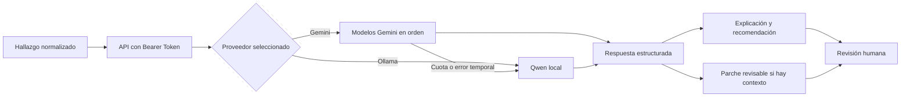

# AI Remediation — API educativa de remediación

API que transforma un hallazgo de seguridad en una explicación sencilla, una recomendación, una forma de comprobar la solución y, cuando existe contexto suficiente, una propuesta de parche.

**Versión de la API:** `0.3.0`

La propuesta es orientativa. La API no modifica repositorios, no ejecuta comandos y nunca sustituye la revisión del alumno o del desarrollador.

## Recorrido de una consulta



## Qué devuelve

| Campo | Contenido |
| --- | --- |
| `explanation` | Explicación breve del problema detectado. |
| `recommendation` | Acción recomendada para corregirlo. |
| `patchProposal` | Diferencia orientativa en formato `unified-diff`, si puede generarse sin inventar datos. |
| `validation` | Pasos para ejecutar las pruebas y repetir el análisis. |
| `learningNote` | Idea principal que conviene aprender del hallazgo. |
| `warnings` | Riesgos o comprobaciones adicionales. |

Todas las propuestas incluyen `requiresHumanReview: true`. Si faltan el archivo afectado o el contexto necesario, `patchProposal.available` se devuelve como `false` y se explica el motivo.

## Proveedores

### Gemini

Cuando `AI_PROVIDER=gemini`, la API prueba los modelos indicados en `GEMINI_MODELS` de izquierda a derecha. Si un modelo alcanza la cuota o devuelve un error temporal, continúa con el siguiente. Si ninguno está disponible, utiliza Qwen mediante Ollama como respaldo local.

### Ollama y Qwen

Cuando `AI_PROVIDER=ollama`, la petición se resuelve directamente en el VPS con el modelo configurado en `OLLAMA_MODEL`. Ollama solo se publica dentro de la red de Docker y no expone su puerto a Internet.

## Configuración

Copia `.env.example` como `.env` y cambia, como mínimo, `AI_API_KEY`:

```env
AI_API_KEY=una-clave-propia
AI_PROVIDER=gemini
OLLAMA_MODEL=qwen2.5-coder:3b
GEMINI_API_KEY=clave-generada-en-google-ai-studio
GEMINI_MODELS=gemini-3.5-flash-lite,gemini-3.1-flash-lite
```

| Variable | Finalidad |
| --- | --- |
| `AI_API_KEY` | Protege la API mediante Bearer Token. |
| `AI_PROVIDER` | Selecciona `gemini` u `ollama` como primera opción. |
| `GEMINI_API_KEY` | Autoriza las peticiones a Google AI. |
| `GEMINI_MODELS` | Define el orden de los modelos Gemini. |
| `OLLAMA_MODEL` | Indica el modelo local utilizado como opción directa o respaldo. |

`GEMINI_MODEL` continúa siendo válido si no se define `GEMINI_MODELS`. El fichero `.env` está excluido de Git y no debe publicarse.

## Iniciar los servicios

```bash
docker compose -f compose.yml up -d --build
docker compose -f compose.yml exec ollama ollama pull qwen2.5-coder:3b
```

La API escucha en el puerto interno `8000`. En Dokploy debe asociarse un dominio HTTPS al servicio `ai-api`. Ollama mantiene su modelo en el volumen `ollama-data`.

Estado del servicio:

```http
GET /health
```

El resultado indica el proveedor predeterminado, el modelo de Ollama y los modelos Gemini configurados.

## Solicitar una remediación

```http
POST /api/v1/remediations
Authorization: Bearer tu-clave
Content-Type: application/json
```

Ejemplo de petición:

```json
{
  "id": "CVE-2021-44228",
  "severity": "CRITICAL",
  "tool": "Trivy",
  "category": "SCA",
  "component": "org.apache.logging.log4j:log4j-core",
  "description": "La versión utilizada contiene una vulnerabilidad conocida.",
  "currentVersion": "2.14.1",
  "fixedVersion": "2.17.1",
  "affectedFile": "pom.xml",
  "sourceContext": "<artifactId>log4j-core</artifactId>\n<version>2.14.1</version>"
}
```

También puede solicitarse un proveedor concreto:

```text
POST /api/v1/remediations?provider=gemini
POST /api/v1/remediations?provider=ollama
```

Los campos `currentVersion`, `fixedVersion`, `affectedFile`, `line` y `sourceContext` son opcionales. Sin embargo, `affectedFile` y `sourceContext` son necesarios para que la API pueda proponer un parche con suficiente información.

## Medidas de seguridad

- La API exige un Bearer Token.
- Las claves se configuran como variables protegidas y no se envían al navegador.
- El contenedor de la API se ejecuta sin privilegios, con sistema de archivos de solo lectura y sin capacidades Linux adicionales.
- Ollama no publica el puerto `11434` hacia Internet.
- Las rutas absolutas y los recorridos con `..` se rechazan.
- El parche se limita a 12.000 caracteres y el contexto recibido a 8.000.
- Ningún cambio se aplica automáticamente.

Los identificadores `CVE-TEST-*` y `TEST-*` se consideran datos de prueba. La API responde sin consultar ningún modelo y nunca genera un parche para ellos.

## Pruebas

```bash
cd api
python -m pip install -r requirements.txt
python -m unittest -v test_main.py
```

Las pruebas comprueban el orden de los modelos Gemini, el respaldo mediante Ollama, la validación del JSON, la revisión humana obligatoria y el rechazo de rutas inseguras.

## Repositorios del TFM

- [Inicializador DevSecOps](https://github.com/CGARCHER/devsecops-learning-initializer).
- [Caso de referencia Movie Review](https://github.com/CGARCHER/movie-review-devsecops-mvp).

---

Creado por [CGARCHER](https://github.com/CGARCHER).
